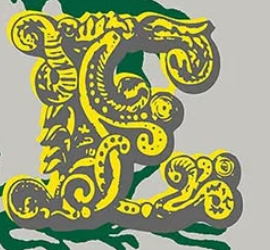

# Expérimentation typographique

Ce projet explore la relation entre forme et narration à travers une série d’expérimentations réalisées en **p5.js**.

## Intention

L’objectif était de créer un système modulaire permettant au lecteur de manipuler une lettre en temps réel.



## Processus

1. Recherche visuelle
2. Dessin vectoriel
3. Intégration dans p5.js
4. Test utilisateur

## Résultat

Le résultat est une lettre « A » interactive, dont la largeur se modifie selon la position de la souris.

### Code source

```js
function draw() {
  background(255);
  let w = map(mouseX, 0, width, 40, 200);
  textSize(w);
  text('A', 50, 200);
}