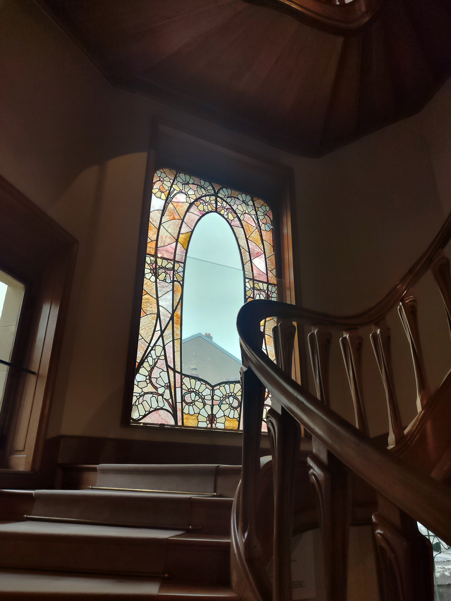

# Une découverte visuelle réelle

Trois ans se sont écoulés, pendant lesquels j'ai vécu à Nancy sans avoir mis le pied dans la Villa Majorelle. C'est seulement lors de la quatrième année que je me décide enfin à m'y rendre. C'est étrange le temps que l'on met avant d'aller dans certains lieux culturels et touristiques de la ville dans laquelle on vit. Pourtant, ce n'est pas comme si le mouvement Art nouveau m'était inconnu et sans intérêt. 

Il a fallu une excuse telle que la visite d'un parent pour que je me décide enfin à aller explorer cette emblème de l'architecture Art nouveau. Qui, d’ailleurs, reste assez accessible, car gratuite pour les étudiants ou les moins de 26 ans, avec aussi une possibilité de double ticket avec le musée de l'École de Nancy et la Villa Majorelle. Je vous invite à aller sur ce site si vous souhaitez plus d'informations et prendre vos tickets : https://musee-ecole-de-nancy.nancy.fr/la-villa-majorelle

Je suis contente d'avoir enfin fait cette démarche, celle de visiter la première maison Art nouveau de Nancy, faite par l'architecte Henri Sauvage, construite entre 1901 et 1902 pour l'artiste Louis Majorelle. Contrairement au musée de l’École de Nancy, j’ai trouvé qu’il y avait ici une plus grande immersion dans cet univers. On nous invite réellement à entrer dans les espaces, à en faire partie. Par exemple, des protections en plastique nous sont remises pour recouvrir nos chaussures, ce qui nous permet de pénétrer dans des pièces qui, dans d’autres anciennes demeures transformées en musées, restent habituellement interdites. Ces protections pourraient être un tout petit peu améliorées mais je trouve qu'elles sont drôles, ça nous donne à tous des looks marrants. Certes, il est demandé de ne pas marcher sur les tapis, mais le fait de pouvoir circuler dans les pièces, s’approcher des objets et tourner autour d’eux renforce le sentiment d’immersion.

Il est aussi particulier de visiter un endroit dont on connaît déjà l’histoire. Le fait d’avoir attendu toutes ces années signifie que j’avais déjà acquis une certaine connaissance de ce que j’allais voir. Les meubles, peintures, vitraux et autres objets que j’avais découverts en photo ou étudiés d’un point de vue technique, je les voyais enfin en vrai. Comme si, avant de pouvoir les observer directement, il m’avait fallu accumuler tout ce savoir — alors qu’en réalité, il ne tenait qu’à moi de venir ici dès ma première année dans cette ville.

Je recommande vivement cette visite, que l’on connaisse ou non son histoire. Et pour ceux qui ont longtemps repoussé : n’ayez pas honte. Parfois, il y a une forme de beauté dans le fait de découvrir — enfin — ce que l’on croyait déjà connaître.

FMLD

---

