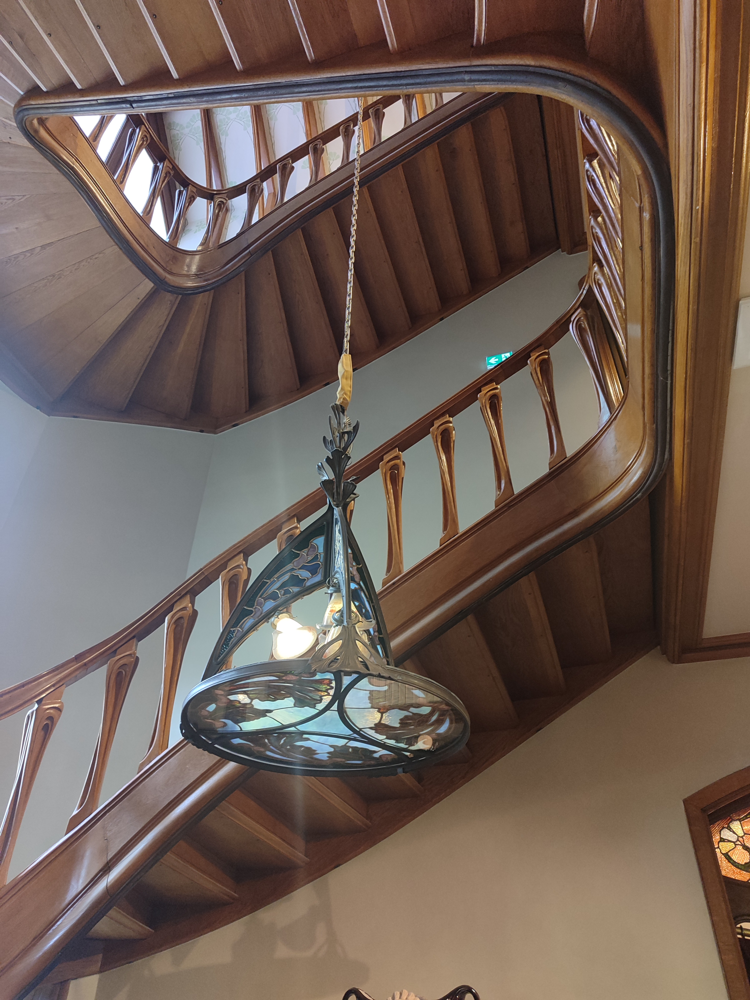
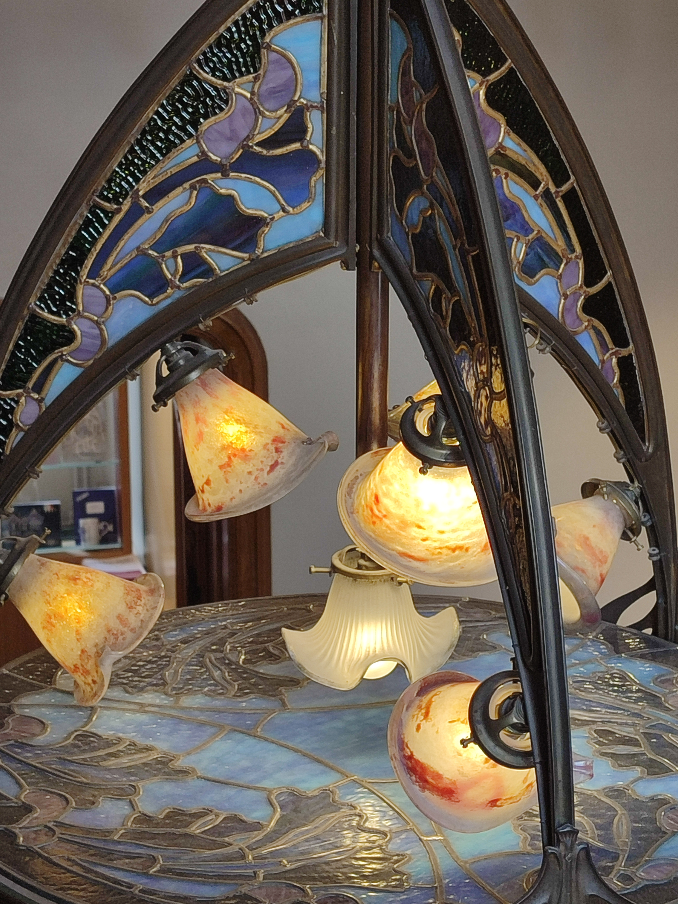
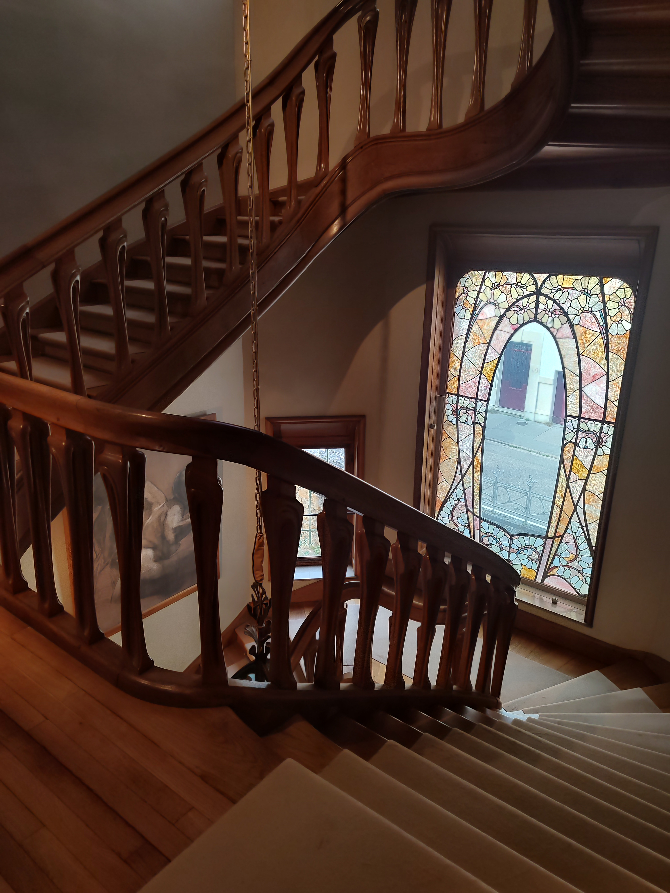

# Une découverte visuelle réelle

Trois ans se sont écoulés pendant lesquels j'ai vécu à Nancy sans avoir mis le pied dans la Villa Majorelle. C'est seulement lors de la quatrième année que je décide enfin de m'y rendre. C’est étrange comme on met du temps à visiter certains lieux culturels ou touristiques de la ville où l’on vit, même lorsque le mouvement Art nouveau ne nous est pourtant ni étranger ni indifférent.

Il aura fallu la visite d’un membre de ma famille pour que je me décide à aller découvrir cette demeure emblématique de l’architecture Art nouveau. L’entrée reste par ailleurs particulièrement accessible : gratuite pour les étudiants et les moins de 26 ans, et disponible en billet combiné avec le musée de l’École de Nancy. Je vous invite à consulter le site officiel si vous souhaitez plus d’informations ou acheter vos tickets.

Je suis contente d’avoir enfin franchi le pas et visité la première maison Art nouveau de Nancy, conçue par l’architecte Henri Sauvage et construite entre 1901 et 1902 pour l'artiste Louis Majorelle. Contrairement au musée de l’École de Nancy, j’ai trouvé ici une immersion plus forte. On nous invite réellement à entrer dans les espaces et à en faire partie. Par exemple, des protections en plastique sont distribuées pour recouvrir nos chaussures, ce qui nous permet de pénétrer dans des pièces qui, dans d’autres demeures transformées en musées, restent souvent interdites. On nous demande de ne pas marcher sur les tapis, mais la possibilité de circuler librement, de s’approcher des objets et de tourner autour renforce l’impression de vivre réellement le lieu.

Il est aussi particulier de visiter un endroit dont on connaît déjà l’histoire. Attendre si longtemps signifie que j’avais accumulé des connaissances, des images, des analyses techniques… que je voyais enfin “en vrai”. Comme si avant de les observer de mes propres yeux, il fallait que je construise une première rencontre à distance — alors qu’il ne tenait qu’à moi de venir dès ma première année ici.

Je recommande vivement cette visite, que l’on connaisse ou non son histoire. Et pour ceux qui ont longtemps repoussé : n’ayez pas honte. Parfois, il y a une forme de beauté dans le fait de découvrir — enfin — ce que l’on croyait déjà connaître.

FMLD

---

