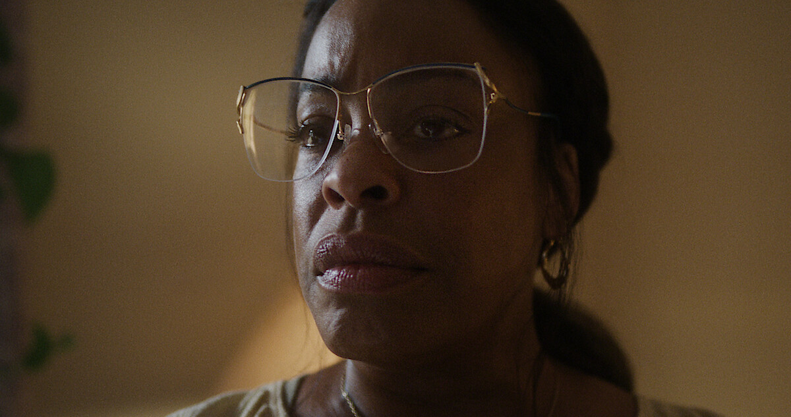

 Bien que la série soit vraiment bien réalisée — avec une atmosphère soignée, un excellent jeu d’acteurs et une mise en scène maîtrisée — elle reste très difficile à regarder. Par moments, on se demande même s’il est juste de raconter une telle histoire sous forme de fiction dramatique plutôt que de documentaire.
Quand il s’agit de vraies victimes, de personnes réelles, montrer des scènes de violence, de démembrement ou d’agression sexuelle semble trop cruel. Ce n’est pas simplement un « film d’horreur » — c’est la reconstitution d’une douleur qui a vraiment existé pour certaines familles.        
C’est pourquoi la série paraît parfois moins comme une tentative de réflexion sur le mal que comme une utilisation de la tragédie à des fins dramatiques.

Il est terrible de donner aux gens la possibilité d’admirer ou de romantiser des criminels. Créer une série qui rejoue et dramatise les actes d’un tueur en série revient en quelque sorte à les glorifier.

Le moment qui m’a fait arrêter de regarder la série, c’est la scène où Dahmer essaie de forcer sa voisine à goûter un sandwich à la viande. À l’écran, on ne voit pourtant rien de vraiment choquant, mais c’est insoutenable. Ce n’est pas la peur au sens classique, c’est une sensation de profond malaise, quand le corps réagit littéralement à une répulsion morale. Le calme, la lenteur et la monotonie des gestes de Jeffrey créent une atmosphère poisseuse, étouffante, qui engloutit le spectateur.

Beaucoup de spectateurs critiquent le personnage de la voisine, parce que son histoire dans la série ne correspond presque pas à la réalité. Mais pour moi, c’est justement ce choix artistique qui fonctionne. En créant un personnage composite, les auteurs ont réussi à montrer l’ampleur de l’horreur à travers son regard — celui d’une femme qui sent que quelque chose d’horrible se passe autour d’elle, mais qui reste totalement impuissante. Ce n’est pas seulement l’histoire d’une personne, c’est une critique de l’indifférence du système, surtout de la police, envers les personnes noires et pauvres. La véritable histoire de la voisine n’aurait peut-être pas provoqué une telle réaction émotionnelle, alors que cette version fictive fait ressentir au spectateur sa peur et son impuissance — la conscience de voir le mal sans pouvoir l’arrêter.

C’est peut-être là que réside la force de la série : elle ne raconte pas seulement l’histoire d’un tueur en série, elle nous fait ressentir ce que cela signifie d’être à côté du mal. Pas comme un simple spectateur, mais comme une personne qui vit derrière le mur et entend, dans l’appartement voisin, quelque chose qui dépasse l’imagination.

Cette histoire aurait dû se concentrer sur les victimes — raconter leurs vies, faire en sorte qu’on se souvienne d’elles. À la place, on a encore eu droit à un acteur hollywoodien de plus et à de nombreuses scènes qui mettent l’accent sur son apparence. La série finit par dire, malgré elle : si tu deviens un tueur en série « réussi », on fera un film sur toi, tu deviendras célèbre, ton nom restera à jamais. Et pire encore : aujourd’hui, Dahmer est discuté sur les réseaux sociaux, certaines personnes l’admirent même parce qu’elles trouvent l’acteur qui l’incarne séduisant.

Pour beaucoup, comme pour moi, c’était la première fois que je découvrais l’histoire de Dahmer — et c’est justement ce qui pose problème. Si la première impression de crimes réels vient d’une fiction déformée par des inventions, le spectateur ne reçoit pas une vérité, mais un choc émotionnel et une réalité faussée.
Il est difficile de percevoir cela comme quelque chose qui s’est réellement passé. À cause de nombreux détails ajoutés — qui, évidemment, ne peuvent pas être connus —, le tout ressemble moins à une reconstitution qu’à une interprétation, une tentative de justification.
    
L’éthique n’a clairement pas sa place dans ce projet. Alors je me demande : quel est le but, quel est le message de cette série, à part gagner de l’argent sur un sujet populaire et un acteur apprécié dans le genre de l’horreur ? Quand une histoire fondée sur une vraie douleur devient un spectacle commercial, сela fait se demander où se trouve la limite entre l’art et l’exploitation.

Pendant le visionnage, on ne ressent pas que c’est une histoire sur les victimes — c’est plutôt une histoire sur Jeffrey Dahmer lui-même, et sur une société qui continue à observer le mal avec curiosité plutôt qu’avec empathie.
    
La série ne pousse pas à réfléchir, ni à être plus prudent ; elle fait seulement ressentir l’horreur, comme dans une attraction.
    
 Mais en aucun cas elle ne rend hommage aux victimes. Et c’est sans doute pour cela qu’après l’avoir vue, il ne reste pas une compréhension, mais un goût amer.
