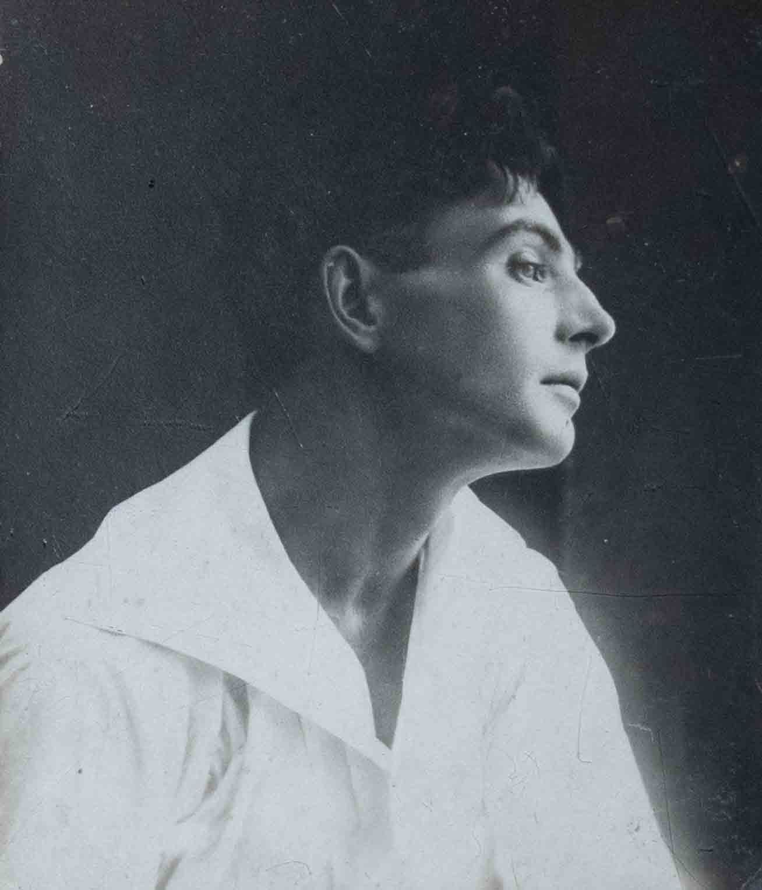
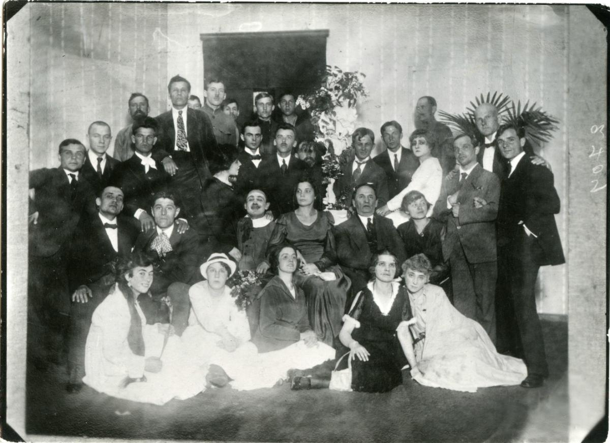

** Les Kurbas ** 
Personne n’a jamais vu tes créations comme tu les avais imaginées. Personne ne pourra vraiment ressentir ton travail, tes émotions, tout ce que tu voulais transmettre.
Mais tu as laissé une trace qui restera pour toujours. Tu es une inspiration, tu es une motivation.

Tu as fondé le « Théâtre Jeune ». Un lieu où le théâtre cessait d’être seulement une scène — il devenait une manière de penser.
Encore aujourd’hui, quand on entre dans le foyer, ton portrait accueille chaque spectateur. Les gens viennent passer leur soirée avec des histoires, des acteurs, de l’art — et tout commence par ton regard. 

Personne parmi nous n’a vu ton « Macbeth », ton « Gaz », ton « Bérézol » — nous n’avons que des fragments, des photos, des souvenirs. Mais il y a quelque chose d’étrange là-dedans : même sans enregistrements, tu es présent. Comme quelqu’un qui a allumé la lumière, et qui la laisse encore briller. 

Et surtout — tu as fait tout cela dans une époque qui ne t’a pas donné la possibilité de te révéler complètement. Ta vie s’est terminée tragiquement, sous la pression des répressions. On n’a pas laissé ton talent se montrer jusqu’au bout. Tes spectacles ne se sont pas conservés.
Mais l’ironie, c’est que justement pour cette raison on parle de toi — parce que ta trace est devenue plus forte que la destruction.

Tu travaillais dans une époque qui ne t’a pas compris. Ce n’est pas «le temps» qui t’a arrêté — c’est le pouvoir.
Ils t’ont détruit. Ils t’ont exécuté parce que ta liberté de pensée leur faisait peur. 

Tu n’as pas vu comment tes idées ont survécu. Mais nous, nous voyons que le théâtre en Ukraine se tient sur tes épaules.

Merci. 
-- N. Phie

"Театр має бути таким, яким суспільство має бути завтра, актор повинен бути не тільки талановитим, але й висококультурним”

